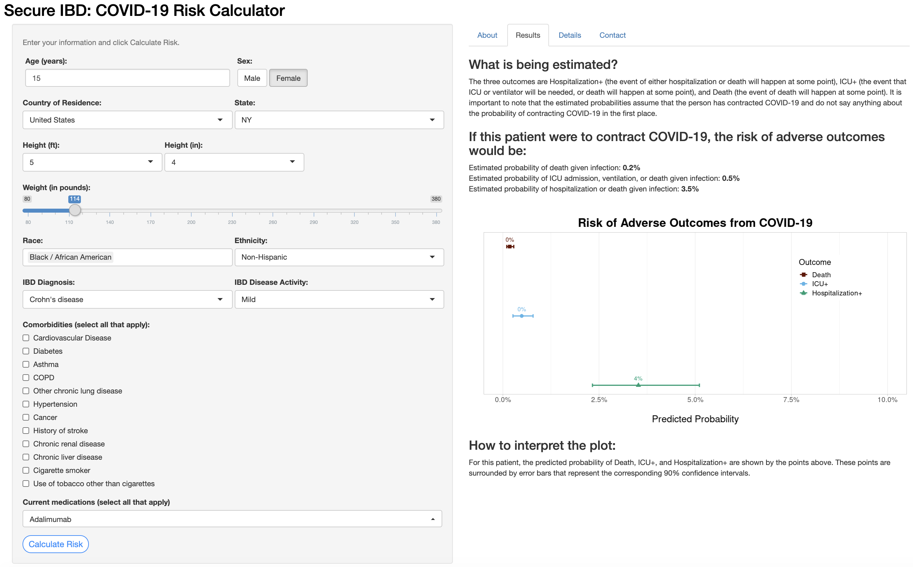

# SECURE-IBD: COVID-19 Risk Calculator

This is a public repository for the code used to fit the models used for the [SECURE-IBD Covid-19 Risk Calculator](https://bmjopen.bmj.com/content/11/11/e049740.long). The data is not publicly available (researchers can request access through the [SECURE-IBD website](https://covidibd.org/sharing-secure-ibd-data/)), but estimated model coefficients are available in this repository.

## Introduction

The online risk prediction tool can effectively predict which unvaccinated patients with inflammatory bowel disease (IBD) may be at higher risk for COVID-19-related morbidity. Three primary outcomes are examined:

- Hospitalization+ (Hospitalization or death)
- ICU+ (ICU admission, mechanical ventilation, or death)
- Death

 ## Features
 - Data Preprocessing
 - Multiple Imputation (multivariate imputation by chained equations)
 - Statistical Modeling (using 85% of cases reported from March-September 2020)
 - Model Performance Evaluation (AUROC based on remaining 15% of cases and 300+ patients added to the registry after model fitting)
 
 ## Software
 
 This analysis was conducted using R Version 4.0.2, and the `tidyverse`, `glmnet`, `glmnetUtils`, `mice`, `magrittr`, `future`, and `pROC` packages. 
 
 The calculator was created using R Shiny.
 
 Below is an example risk prediction for a patient with below-average predicted risk. Young age, gender and a lack of comorbidities contribute to a lower-than-average risk of adverse COVID-19 outcomes.
 

## Reference

For further details, please reference the [paper](https://bmjopen.bmj.com/content/11/11/e049740.long):

Sperger, J., Shah, K. S., Lu, M., Zhang, X., Ungaro, R. C., Brenner, E. J., Agrawal, M., Colombel, J.F., Kappelman, M.D., & Kosorok, M. R. (2021). Development and validation of multivariable prediction models for adverse COVID-19 outcomes in patients with IBD. *BMJ Open*; **11**:e049740.  doi:10.1136/
bmjopen-2021-049740
